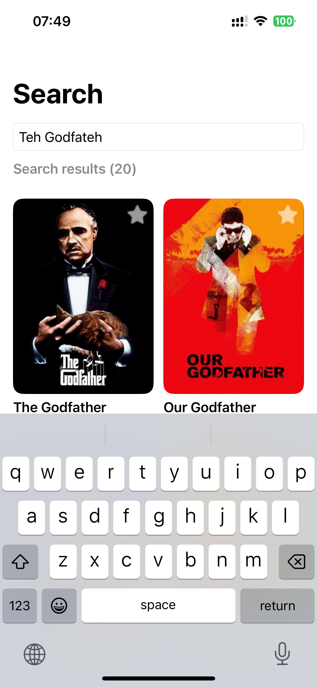
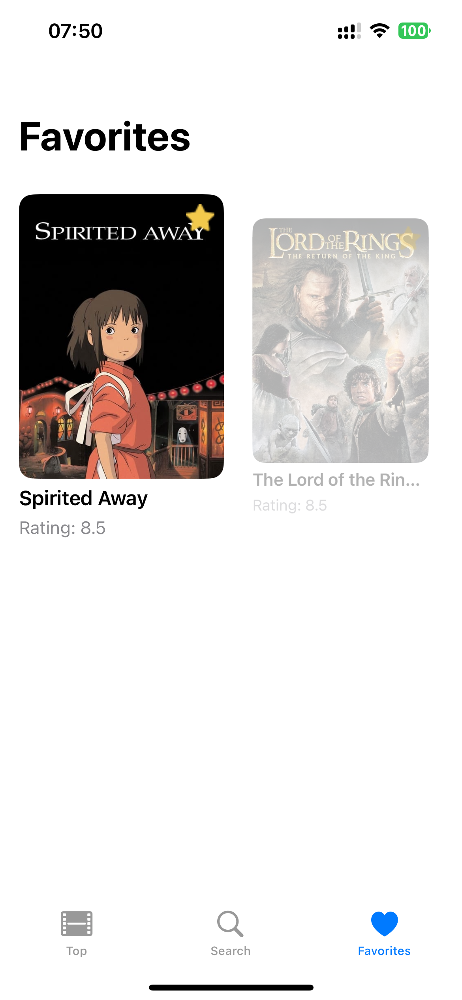

MoviesApp(iOS)

1. App idea
- Goal: fast movie browsing with parallel pagination, typo‑tolerant search, and responsive UI
- Layers (Clean MVVM): App (DI, config), Data (NetworkClient + DTOs + Repositories + UserDefaults), Domain (Entities, UseCases), Presentation (SwiftUI Views/ViewModels, components), Common (Extensions, Theme, Utils)
- Features:
1) pagination with two concurrent requests(page n and n+1), merge + unique by id for smooth infinite grid
2) fuzzy search with tokenization + adjacent transpositions(Damerau‑style) to build candidates, ranked by Levenshtein distance

3) reactive UI with Combine for debounced queries and favorites sync across tabs via idsPublisher
4) theming(system/light/dark)

5) animations(circular DotsLoader, fade/scale removal in Favorites)

6) the data that was downloaded while there was internet access and the color theme remain when you re-enter the application
- Patterns:
- Repository(separate data access from domain logic)
- UseCase
- DI(all dependencies are wired in AppContainer and ViewModelFactory)
- Publisher–Subscriber(Observer)(for syncing favorites across tabs)
- Factory Method

2. AI tools used - Copilot:
- Assisted with fuzzy-search pipeline(candidate generation, Levenshtein ranking)
- Suggested network retry-on-offline approach with NWPathMonitor.

3. How to run
1) Clone this repository
2) Requirements: Xcode 15+, iOS 15+ target. No third‑party dependencies.
3) Open MoviesApp.xcodeproj, select the MoviesApp scheme, run on any iOS 15+ simulator/device

(NOTICE: the app reads TMDB_API_KEY from Secrets.private.plist if present; otherwise falls back to Secrets.public.plist specially included in the project. NO SETUP REQUIRED TO RUN. If you want to use your own key, add App/Configuration/Secrets.private.plist with TMDB_API_KEY)

4. Figma: https://www.figma.com/design/vOvq7tdIgQXDA5Qg8fzVpf/iOS_test_screens?node-id=1-2&p=f&t=d6Z6lersHskHn8db-0 